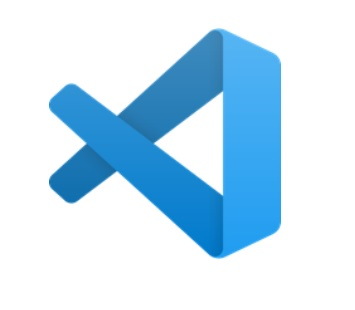
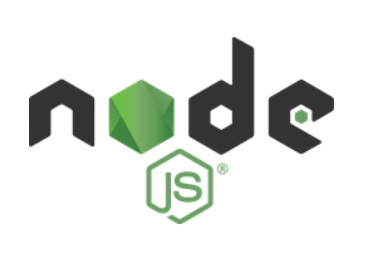
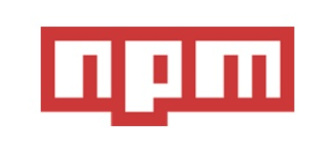
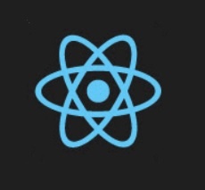

# 📌 **Configuração de Ambiente React**
## 🎯 **Objetivo**
Configurar todo o ambiente de desenvolvimento e estar apto
a iniciar os estudos de React.

 

## 🌐 **Pré-requisitos**
Computador com Windows, Linux ou Mac.

 

## 🏁 **Percurso**
### **Etapa 1:** Instalando o visual studio code
### **Etapa 2:** Node e NPM
### **Etapa 3:** Yarn
### **Etapa 4:** React DevTools
### **Etapa 5:** Extensões para Visual Studio Code

 

## ✅ **Etapa 1: Instalando o visual studio code**
### **O que é o Visual Studio Code**
O Visual Studio Code é um editor de código-fonte desenvolvido pela Microsoft para Windows, Linux e macOS. Ele inclui suporte para controle de versionamento, realce de sintaxe, snippets e refatoração de código.

 

 

### **Alternativa para VSCode**

 

 

### **Como instalar o VSCode**
### Link: https://code.visualstudio.com/

 

## ✅ **Etapa 2: Node e NPM**
### **O que é o Node**
Node.js é um runtime de JavaScript, criado pelo desenvolvedor Ryan Dahl em 2009. o Node.js, foi desenvolvido em cima do motor JavaScript V8 – engine criada pelo Google e utilizada nos navegadores Chrome.

 

 

### **O que é o NPM**
O NPM (Node Package Manager), é o gerenciador de pacote padrão do node. Ele é utilizado como gerenciamento de pacotes, fluxo de trabalho em linguagens de programação e ferramenta para construção de frontends em aplicativos e websites.

 

 

### **Instalar o Node e NPM**
### Link: https://nodejs.org/en/

 

## ✅ **Etapa 3:** Yarn
### **O que é o Yarn**
O Yarn é um gerenciador de pacotes para aplicar comandos prontos ao código de uma aplicação.

 

 

### **Instalar o Node e NPM**
### Link: https://yarnpkg.com/getting-started/install

 

## ✅ **Etapa 4:** React DevTools
### **O que é o React DevTools**
É uma extensão disponível para o Chrome, Firefox e também como um aplicativo independente que permite inspeccionar a hierarquia de componentes do React nas Ferramentas do desenvolvedor do navegador.

 

 

### **Instalar o React DevTools**
### Link: https://github.com/facebook/react/tree/main/packages/react-devtools-extensions

 

## ✅ **Etapa 5: Extensões para Visual Studio Code**
### **O porque utilizar extensões?**
Costumam ser leves, não comprometem o funcionamento
do software e são de fácil instalação. Cada dev tem a sua
maneira de programar e é por isso que as extensões
podem ser ótimas aliadas! Com elas, conseguimos adaptar
o VSCode às nossas necessidades, criando na rotina de
trabalho e estudo um ambiente mais funcional.

- Color Highlight
- Color Picker
- EditorConfig for VS Code
- ES7 React/Redux/React-Native/JS snippets
- ESLint
- Git Graph
- Markdown Preview Github Styling
- Material Icon Theme
- GitHub Theme
- Prettier - Code formatter
- Todo Tree
- Turbo Console Log

 

## 💻 **Links Úteis**
- https://pt-br.reactjs.org/
