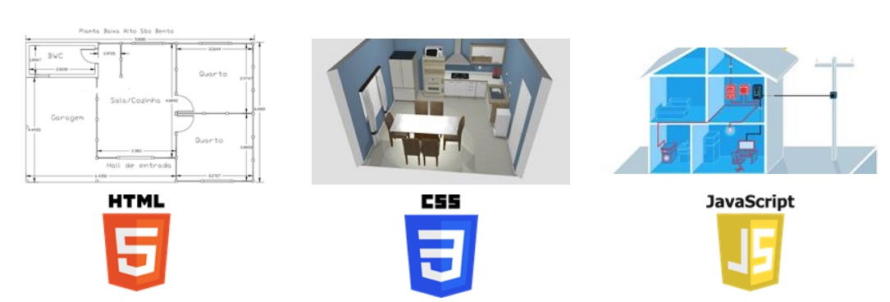
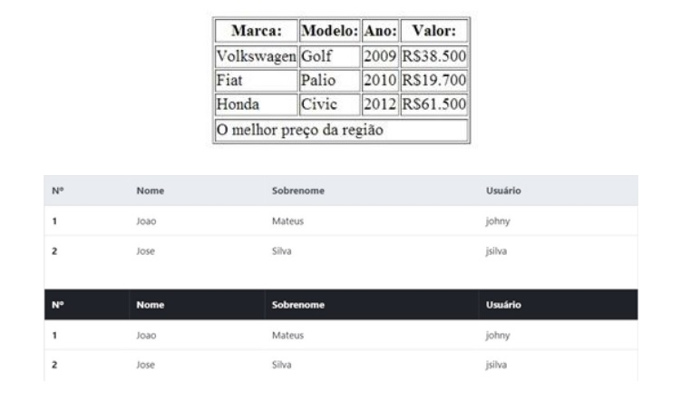
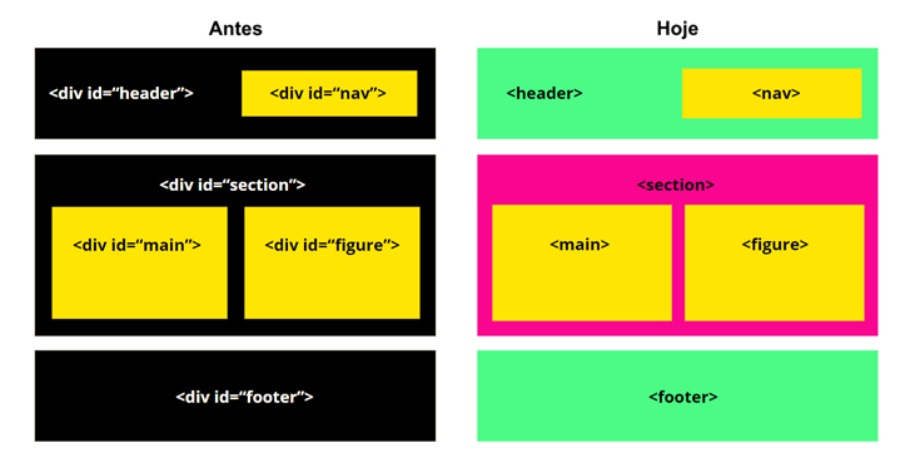

# 📌 **Páginas Web com HTML**
## 🎯 **Objetivo**
Entender o que é o HTML e construir estruturas básicas de um
site.

<br>

## 🌐 **Pré-requisitos**
Editor de código (Visual Studio Code)

<br>

## 🏁 **Percurso**
### **Etapa 1:** Como funciona a Web
### **Etapa 2:** O que é HTML
### **Etapa 3:** Tags básicas
### **Etapa 4:** Metas tags
### **Etapa 5:** Listas
### **Etapa 6:** Tabelas
### **Etapa 7:** Formulários
### **Etapa 8:** HTML Semântico


<br>

## ✅ **Como funciona a Web**
A Web é constituida por 3 partes.



Como a Web funciona oferece uma visão simplificada do que acontece quando você vê uma página em um navegador, no seu computador ou telefone.

Essa teoria não é essencial para escrever códigos em curto prazo, mas em pouco tempo você vai se beneficiar ao entender o que está acontecendo em segundo plano.

### Clientes e servidores
Computadores conectados à web são chamados clientes e servidores. Um diagrama simplificado de como eles interagem pode ter essa aparência:


- Clientes são os típicos dispositivos conectados à internet dos usuários da web (por exemplo, seu computador conectado ao seu Wi-Fi ou seu telefone conectado à sua rede móvel) e programas de acesso à Web disponíveis nesses dispositivos (geralmente um navegador como Firefox ou Chrome).

- Servidores são computadores que armazenam páginas, sites ou aplicativos. Quando o dispositivo de um cliente quer acessar uma página, uma cópia dela é baixada do servidor para a máquina do cliente para ser apresentada no navegador web do usuário.

<br>

## ✅ **O que é HTML**
O acrônimo HTML significa HiperText Markup Language, traduzindo ao português: Linguagem de Marcação de Hipertexto. O HTML é o componente básico da web, ele permite inserir o conteúdo e estabelecer a estrutura básica de um website. Portanto, ele serve para dar significado e organizar as informações de uma página na web.

Através de um documento HTML, ou seja, um documento com
a extensão .html ou .htm., o navegador faz a leitura do arquivo e renderiza o seu conteúdo para que o usuário final possa visualizá-lo. Os arquivos .html podem ser visualizados em qualquer navegador (Google Chrome, Safari, ou Mozilla
Firefox).

Geralmente um site é composto por diversas páginas HTML,
sendo uma para cada página do website. Cada página consiste
em uma série de tags , que podem ser considerados os blocos
de construção das páginas. Portanto, esses blocos são a
maneira com a qual o HTML faz a marcação dos conteúdos, criando a hierarquia e a estrutura do mesmo, dividido entre
seções, parágrafos, cabeçalhos, e outros.

<br>

## ✅ Tags básicas
```
<h1>,<h2>,<h3>,<h4>,<h5 >e <h6>
```
Tags para definir um título e subtítulos, variando de 1 a 6, sendo h1 o título mais importante e h6 o de menor importância.

```
<p> - Tags para definir um parágrafo;
<a> – Tag de link, junto ao atributo href;
<header> – define um cabeçalho;
<section> – define uma seção;
<article> – define um artigo;
<div> – define uma divisão;
<footer> – define um rodapé;
<nav> – define uma área de navegação (como menus);
<table> – define uma tabela;
<ol> – define uma lista ordenada;
<ul> – define uma lista não ordenada;
<li> – define o item de uma lista;
<form> – define um formulário;
<input> – define os campos do formulário;
<textarea> – define uma área para o usuário digitar um texto;
<button> – define um botão;
 – permite inserir uma imagem no seu documento.
```

<br>

## ✅ **Meta Tags**
Meta tags são linhas de código HTML ou "etiquetas" que, entre outras coisas, descrevem o conteúdo do seu site para os buscadores. É nelas que você vai inserir as palavras-chave que facilitarão a vida do usuário na hora de te encontrar

```
<meta name="keywords" content="sites, web, desenvolvimento, html, design">

<meta name="description" content=" Meta Tags - O que são e como utilizá-las">

<meta http-equiv="content-language" content="pt-br">

<meta http-equiv="content-type" content="text/html; charset=iso-8859-1">

<meta name="author" content="Pablo Henrique">

<meta http-equiv="refresh" content=" 5; url=http://www.novosite.com/">
```

<br>

## ✅ **Listas**
As listas são muito importantes quando queremos listar alguns itens no site e também para a criação de menu de navegação.

- Listas ordenadas
- Listas desordenadas
- Listas por definição


<br>

## ✅ **Tabelas**
As tabelas são listas de dados em duas dimensões e são compostas por linhas e colunas. Portanto, são muito utilizadas para apresentar dados de uma forma organizada.



<br>

## ✅ **Formulários**
O formulário HTML é um formulário de preenchimento de dados ou que resulta em uma ação desejada utilizando a linguagem de marcação HTML. É formado por um ou mais campos. Esses campos podem ser de textos, caixas de seleção, botões, radio buttons e checkboxes utilizando tags do próprio HTML. Dessa forma, o usuário pode interagir com a página ao executar ações através desses formulários.

<br>

## ✅ **HTML Semântico**
O HTML semântico é a forma de deixar o site com suas informações bem explicadas e compreensíveis para o computador, ajudando até mesmo em sua busca no Google e facilitando o entendimento de leitores de acessibilidade.

### Porque utilizar HTML Semântico
Além de facilitar a busca de forma orgânica e rankear sua página em mecanismos de busca, o HTML semântico ajuda os leitores de tela para deficientes visuais, facilitando seu compreendimento. Ele, também, deixa seu código mais limpo e mais compreensível, tanto em organização como em facilidade de visualizar uma tag específica só de passar o olho pela tela.



<br>

## 💻 **Links Úteis**

- https://www.w3schools.com/html/default.asp

- https://developer.mozilla.org/pt-BR/docs/Web/HTML