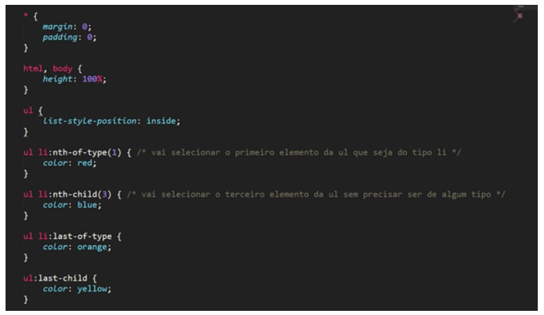
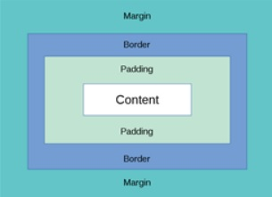
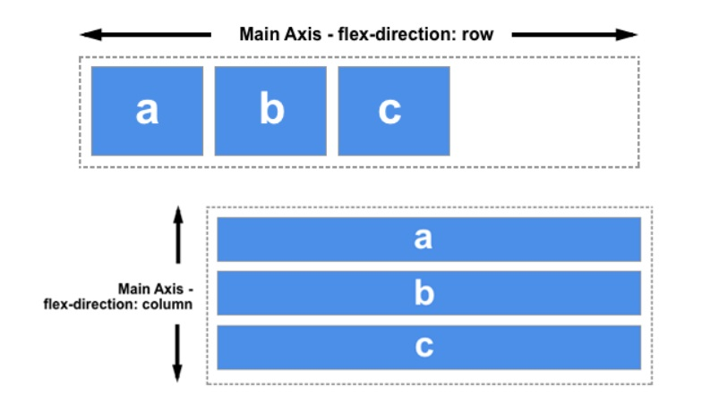
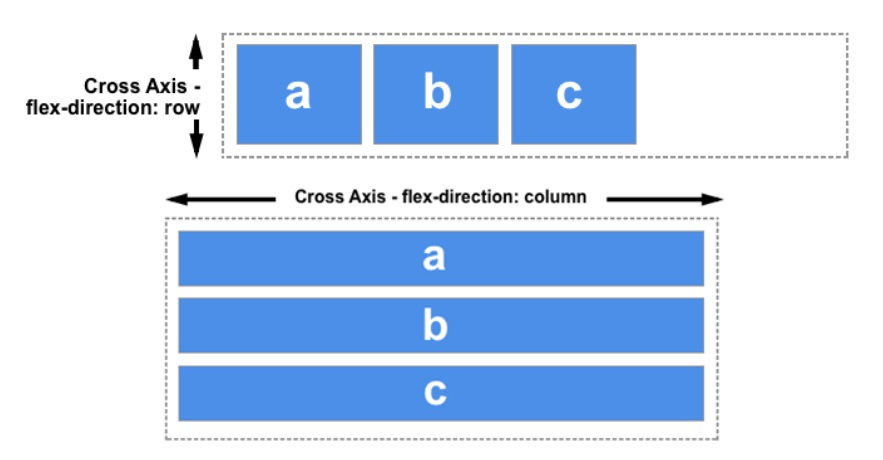
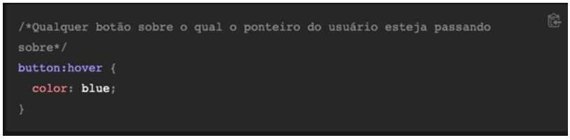

# 📌**Estilizando Páginas com CSS**
## 🎯 **Objetivo**
Entender o que é o CSS e como fazer estilizações na página
web.

<br>

## 🌐 **Pré-requisitos**
Editor de código (Visual Studio Code)

<br>

## 🏁 **Percurso**
### **Etapa 1:** O que é CSS
### **Etapa 2:** O que é seletores
### **Etapa 3:** Caixas (Box Models)
### **Etapa 4:** Flexbox
### **Etapa 5:** Pseudo-classes e elementos
### **Etapa 6:** Media Queries

<br>

## ✅ **O que é CSS**
O CSS é chamado de linguagem Cascading Style Sheet e é usado para estilizar elementos nas páginas web. O CSS separa o conteúdo da representação visual do site. Pense na decoração da sua página. Utilizando o CSS é possível alterar a cor do texto e do fundo, fonte e espaçamento entre parágrafos. Também pode criar tabelas, usar variações de layouts, ajustar imagens para suas respectivas telas e assim por diante.

### Primeiro contato com css



<br>

## ✅ **O que é seletores**
Os seletores são usados para direcionar os elementos HTML em nossas páginas da web que queremos estilizar. Há uma grande variedade de seletores CSS disponíveis, permitindo uma precisão refinada ao selecionar os elementos a serem estilizados.

Exemplo:
```
h1 {
    color: blue;
    background-color: yellow;
}

p {
    color: red;
}
```

### **Exemplo de seletores**
### Tipo
```
h1 { }
```

### Classe
```
.box { }
```

### ID
```
#unique { }
```

### Seletores de atributos
```
a[title] { }

a[href="https://exemplo.com"] { }
```

<br>

## ✅ **Caixas (Box Models)**
Em uma página WEB, cada elemento é representado como um box retangular. Determinar o tamanho, propriedades - como sua cor, fundo, estilo das bordas - e a posição desses boxes é o objetivo do mecanismo de renderização.

No CSS, cada um desses boxes retangulares é descrita usando
o box model padrão. Este modelo descreve o conteúdo do
espaço ocupado por um elemento. Cada box possui 4 edges:
margin edge, border edge, padding edge e content edge.



<br>

## ✅ **Flexbox**
O flexbox foi projetado tanto como um modelo de layout unidimensional quanto como um método capaz de organizar espacialmente os elementos em uma interface, além de possuir capacidades avançadas de alinhamento. Quando se descreve o flexbox como sendo unidimensional, enfatiza-se o fato de que ele lida com o layout em uma dimensão de cada vez - seja uma linha ou uma coluna.

### Os eixos do flexbox
Para se utilizar o flexbox, é preciso ter em mente que todas as operações realizadas relacionam-se a dois eixos: o eixo principal e o eixo transversal. O eixo principal é definido através da propriedade flex-direction e o eixo transversal encontra-se na direção perpendicular a ele.

### O eixo principal (Main Axis)



### O eixo transversal (Cross Axis)



<br>

## ✅ **Pseudo-classes e elementos**
Uma pseudo-classe CSS é uma palavra-chave adicionada a seletores que especifica um estado especial do elemento selecionado. Por exemplo, :hover pode ser usado para alterar a cor de um botão quando o usuário passar o cursorsobre ele.



<br>

## ✅ **Media Queries**
é a utilização de Media Types com uma ou mais expressões envolvendo características de uma media para definir formatações para diversos dispositivos. Os browsers ou as aplicações lêem as expressões definidas na Query, caso o dispositivo em questão se encaixe nessas requisições o CSS será aplicado.

### Media types
Os media types definem para que tipo de media um certo código CSS é direcionado. O HTML foi gerado para ser portátil, ou seja, lido e interpretado por qualquer tipo de dispositivo. Só que cada dispositivo exibe o HTML de uma maneira, devido a fatores como, por exemplo, as dimensões da tela. Supondo que visatamos um site através de um desktop, ele não terá a mesma reação de que se visitarmos por um dispositivo móvel.

### Utilizando Media Queries


<br>

## 💻 **Links Úteis**
- https://www.w3schools.com/css/default.asp

- https://developer.mozilla.org/pt-BR/docs/Web/CSS