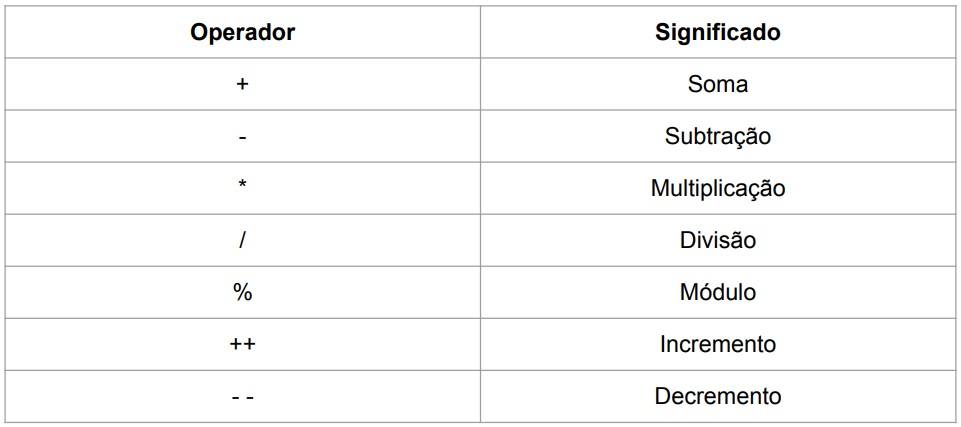
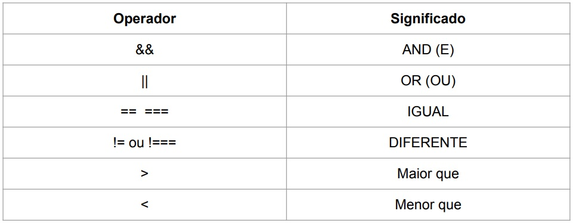

# 📌**Tornando Páginas Web Interativas com JavaScript**
## 🎯 **Objetivo**
Entender o que é o Javascript e fazer interações nas páginas
web tornando-as mais dinâmicas.

<br>

## 🌐 **Pré-requisitos**
Editor de código (Visual Studio Code)

<br>

## 🏁 **Percurso**
### **Etapa 1:** O que é Javascript
### **Etapa 2:** Operações Básicas
### **Etapa 3:** Condicionais
### **Etapa 4:** Tipos de variáveis
### **Etapa 5:** Laços de repetições

### **Etapa 6:** Arrow Functions
### **Etapa 7:** Arrays
### **Etapa 8:** Funcionalidades do ES6+

<br>

## ✅ **O que é Javascript**
### A história do Javascript
JavaScript é uma Linguagem de Programação, criada por Brendan Eich, a pedido da empresa Netscape, em meados de 1995. No início, o JavaScript foi batizado com outro nome: LiveScript. No entanto, a Netscape não ficou sozinha com o desenvolvimento do JavaScript. A empresa SUN Microsystems interessou-se por ela e entrou de cabeça no desenvolvimento desta nova linguagem, uma vez que acreditava na ideia inovadora que era o JavaScript.

### JAVA x JavaScript
Com o sucesso inicial do JavaScript, a mudança do nome de LiveScript para JavaScript foi inevitável, e, com certeza, veio por influência da própria SUN, que mantém uma Linguagem de Programação chamada JAVA. É claro que as Linguagens de Programação JAVA e JavaScript são parecidas somente no nome, já que se diferem no conceito e no uso.

### ECMAScript e JavaScript
A ideia da web é funcionar igual para todos. A fim de manter um padrão, em novembro de 1996 a Netscape enviou o JavaScript à ECMA International, uma associação fundada em 1961 que padroniza sistemas de informação. Já que o nome JavaScript pertencia à Sun, foi preciso registrar com um novo nome. Assim surgiu o nome ECMAScript. Porém, como o nome JavaScript já estava famoso, continuamos chamando a linguagem assim até hoje em todos os lugares.

### O que é Javascript
JavaScript é uma linguagem de programação de alto nível criada, a princípio, para ser executada em navegadores e manipular comportamentos de páginas web. Com seus scripts é possível incluir, em uma página estática, elementos dinâmicos como mapas, formulários, operações numéricas, animações, infográficos interativos e muito mais.

<br>

## ✅ **Operações Básicas**
Os operadores aritméticos são utilizados para a realização de cálculos simples em JavaScript. Representam as operações matemáticos básicas de soma, subtração, divisão e multiplicação, além de algumas operações especiais, como o módulo e incremento / decremento.



<br>

## ✅ **Condicionais**
As estruturas condicionais estão ligadas à tomada de decisão de um algoritmo. Ao utilizar expressões que retornam verdadeiro ou falso, o algoritmo executa o bloco de comandos relativos a este resultado.

### Estruturas condicionais básicas
- if
- else
- switch
- ternario

### Operadores lógicos



<br>

## ✅ **Tipos de variáveis**
### O que é variáveis
Você usa variáveis como nomes simbólicos para os valores em sua aplicação. O nome das variáveis, chamados de identificadores, obedecem determinadas regras. Uma variável em JavaScript deve começar com uma letra, underline (_), os caracteres subsequentes podem também ser números (0-9). Devido JavaScript ser case-sensitive, letras incluem caracteres de "A" a "Z" (maiúsculos) e caracteres de "a" a "z" (minúsculos).

### Declarações de variáveis
Existem três tipos de declarações em JavaScript.
```
var nome = 'Pablo'

let idade = 25

const aprovado = true
```

### Tipos de variáveis
```
Boolean = true e false.

null = Nulo

undefined = Não definido

Number = 42 ou 3.14159

String = "Howdy"
```

<br>

## ✅ **Laços de repetições**
Laços em Javascript (ou loops) são uma maneira eficaz de se trabalhar com estruturas de repetições baseadas em estruturas condicionais dentro da linguagem, ao invés de repetir milhares de vezes determinado código, você pode utilizar os laços para repetir qualquer coisa até que qualquer outra coisa aconteça.

- for
- while
- foreach
- map

<br>

## ✅ **Arrow Functions**
### Functions
De modo geral, função é um "subprograma" que pode ser chamado por código externo (ou interno no caso de recursão) à função. Assim como o programa em si, uma função é composta por uma sequência de instruções chamada corpo da função. Valores podem ser passados para uma função e ela vai retornar um valor.
```
function Soma(num1, num2) {
    return num1 + num2
}
```

### Arrow Functions
A versão do ECMA Script 2015 do JavaScript, trouxe uma nova forma mais sucinta de trabalhar com funções chamada de Arrow Functions, por causa da sintaxe que lembra uma flecha: () =>.
```
const Soma = (num1, num2) => {
    return num1 + num2
}
```

<br>

## ✅ **Arrays**
### O que são Arrays
Arrays são geralmente descritas como "lista de objetos"; elas são basicamente objetos que contem múltiplos valores armazenados em uma lista. Um objeto array pode ser armazenado em variáveis e ser tratado de forma muito similar a qualquer outro tipo de valor, a diferença está em podermos acessar cada valor dentro da lista individualmente, e fazer super úteis e eficientes coisas com a lista, como laço através da lista e fazer a mesma coisa para cada valor.

### Exemplo de arrays
```
var shopping = ['bread', 'milk', 'cheese', 'hummus', 'noodles'];
shopping;

let cities = [
    {name: 'Los Angeles', population: 3792621},
    {name: 'New York', population: 8175133},
    {name: 'Chicago', population: 2695598},
    {name: 'Houston', population: 2099451},
    {name: 'Philadelphia', population: 1526006}
]
```

<br>

## ✅ **Funcionalidades do ES6+**
- filter
- find
- findIndex
- reduce
- some
- every

<br>

## 💻 **Links Úteis**
- https://www.w3schools.com/js/default.asp

- https://developer.mozilla.org/pt-BR/docs/Learn/JavaScript
