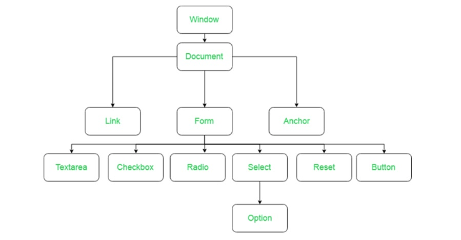

# 📌**Entendendo o DOM (Document Object Model)**
## 🎯 **Objetivo**
Entender o que é a DOM (Document Object Model) e como
manipulada usando javascript.

 

## 🌐 **Pré-requisitos**
Editor de código (Visual Studio Code)

 

## 🏁 **Percurso**
### **Etapa 1:** O que é DOM
### **Etapa 2:** Manipulando a DOM com javascript

 

## ✅ **O que é DOM**
O DOM (Document Object Model) é a representação de dados dos objetos que compõem a estrutura e o conteúdo de um documento na Web. O Document Object Model (DOM) é uma interface de programação para os documentos HTML e XML. Representa a página de forma que os programas possam alterar a estrutura do documento, alterar o estilo e conteúdo. O DOM representa o documento com nós e objetos.

 

## ✅ **Manipulando a DOM com JavaScript**
O DOM não é uma linguagem de programação, mas sem ele, a linguagem JavaScript não teria nenhum modelo ou noção de páginas web, páginas XML e elementos com os quais ela geralmente lida. Cada elemento de um documento faz parte do Document Object Model, para que possam ser acessados e manipulados usando o DOM e uma linguagem de script, como JavaScript.

### Operações Básicas
- getElementsByTagName
- getElementsByClassName
- getElementById
- querySelector

 

## 💻 **Links Úteis**
- https://developer.mozilla.org/pt-BR/docs/Web/API/Document_Object_Model/Introduction