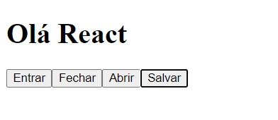

# 📌**Primeiros Passos na Biblioteca React**
## 🎯 **Objetivo**
Entender o que é o React e seus conceitos e criar a sua
primeira aplicação.

<br>

## 🌐 **Pré-requisitos**
Editor de código (Visual Studio Code)

<br>

## 🏁 **Percurso**
### **Etapa 1:** O que é o React
### **Etapa 2:** Framework x Biblioteca
### **Etapa 3:** Criando Primeiro Projeto.
### **Etapa 4:** Componentes de Classes x Funcionais
### **Etapa 5:** Conceito de components e Props
### **Etapa 6:** Entendendo o ciclo de vida de um componente

<br>

## ✅ **Etapa 1: O que é o React**
### **A história do React**
React JS é uma biblioteca JavaScript para a criação de
interfaces de usuário. Criado em 2011 pelo time do Facebook,
o React surgiu com o objetivo de otimizar a atualização e a
sincronização de atividades simultâneas no feed de notícias da
rede social, entre eles chat, status, listagem de contatos e
outros.

A princípio, todas essas atividades, chamadas de estados,
tinham uma descrição muito complexa. Com o React, esta
descrição torna-se mais simples, bem como também é
simplificada a conexão entre HTML, CSS e JavaScript e todos os
componentes de uma página.

Por ter demonstrado grande eficiência, nos anos que se
seguiram o React foi incorporado à interface de outras redes
sociais do grupo, como o Instagram e, em 2013, seu código foi
aberto à comunidade, dando início a sua popularização.

<br>

## ✅ **Etapa 2: Framework x Biblioteca**
### **Biblioteca**
Esse é o recurso mais utilizado no mundo da programação e
muitas pessoas nem se dão conta do quanto utilizam. A ideia
da biblioteca é compartilhar soluções por meio de funções ou
métodos. Por Exemplo: Se você tiver que fazer um trabalho de
matemática, por exemplo, poderá ir até uma biblioteca física,
pegar um livro e utilizar equações desenvolvidas no livro.
Então, não será preciso desenvolver as equações desde o início.

### **Exemplo de Biblioteca**
- Moment.js
- Chart.js
- Voca
- mo.js
- React

### **Frameworks**
O framework nada mais é do que uma ferramenta que vai te
ajudar a ter como único objetivo focar em desenvolver o
projeto, não em detalhes de configurações.

### **Exemplos de Frameworks**
- Angular
- Vuex
- Ionic
- Next
- Express
- LoopBack

<br>

## ✅**Etapa 3: Criando Primeiro Projeto**

Para criar um projeto ract execute o comando abaixo no terminal:
```
npx create-react-app <nome da pasta>

//Exemplo Criado
npx create-react-app dio

cd dio
```
Para rodar o projeto execute o comando abaixo no terminal:
> *Certifique-se de estar na pasta criada do projeto*

```
npm start
```

<br>

## ✅ **Etapa 4: Componentes de Classes x Funcionais**

### **Componentes de classes**
Componentes de classe são componentes que possuem um alto nível de poder dentro da aplicação, pois além gerenciar o próprio estado, herdam os chamados métodos de ciclo de vida do React, lidam com partes lógicas da aplicação e manipulam eventos através de métodos que podem ser invocados em qualquer lugar do componente ou em seus filhos.
```
import React, { Component} from "react";

export default class AppClass extends Component {
    constructor(props) {
        super(props);
        this.state = { counter: 0};
        this.handleClick = this.handeClick.bind(this);
    }

    handeClick() {
        // TODO
    }

    render() {
        return <div>AppClass</div>;
    }
}
```

### **Componente Funcional**
Os componentes funcionais sem estado, são representados por funções JavaScript e como o nome sugere, não se preocupam (e nem devem se preocupar) com o gerenciamento de estado do componente, mas apenas com a apresentação dos dados na aplicação.
```
function App() {

    const handleClick = () => {
        // TODO
    }

    return <div className="App">Olá React</div>;
}

export default App;

```
Uma vez atribuído seus valores, o resultado final de ambos os componentes será o mesmo, pois a ideia por trás desse exemplo é mostrar como declarar cada tipo de componente e entender como o React trabalha com essas informações.

Embora os componentes façam exatamente a mesma coisa, algo um tanto diferente ocorre na forma como acessamos os dados recebidos por props. No componente de classe precisamos estender a classe Component padrão do React e acessar seus valores através do objeto this.

Já no componente funcional, o this não existe, pois o mesmo é apenas uma função que pode acessar os valores do objeto diretamente, exatamente como se estivesse recebendo esses dados por parâmetros.

Outra diferença bastante notável está na simplicidade e na quantidade de linhas de código que são usadas para criar cada tipo de componente, o que reflete também na performance da aplicação uma vez que funções são executadas um pouco mais rapidamente do que classes.

### **Componentes de classe ou componentes funcionais?**
Escolha componentes funcionais sempre que possível (por serem mais simples e mais rápidos), ou seja, quando você apenas quer exibir alguma UI.

Use componentes de classe sempre que existir tarefas mais complexas a serem feitas, como lidar com alguma lógica, gerenciar o estado e manipular eventos.

### **Cenários de escolha reais**
- Você quer criar um componente que exibe o avatar do usuário
- Você quer criar um componente padrão para exibir posts
- Você quer criar um componente de dropdown
- Você quer criar um componente de busca
- Você quer criar uma tabela para exibir uma lista de dados
- Você quer criar um componente que valide os dados de um formulário
- Você quer criar um componente que exiba um loader

### **Escolhas reais para cada cenário**
Se você fosse criar tais componentes, de que tipo eles seriam? Vamos dar uma olhada mais de perto em cada item.

- Componente funcional sem estado
- Componente funcional sem estado
- Componente de classe
- Componente de classe
- Componente funcional sem estado
- Componente de classe
- Componente funcional sem estado

O motivo da escolha de cada item se baseia na responsabilidade de cada componente. Note que o padrão citado acima se torna cada vez mais evidente em cada caso de uso.

Para os casos 1, 2, 5 e 7 sempre vamos preferir usar componentes funcionais, pois eles sempre irão **exibir** informações, sem a necessidade de executar tarefas mais complexas.

Para os casos 3, 4 e 6 sempre vamos preferir usar componentes de classe, pois eles sempre irão executar **mais tarefas** além de apenas exibir algum dado na tela do usuário.

Um dropdown, por exemplo, precisaria de pelo menos 1 estado (aberto/fechado) para funcionar como esperado, assim como uma busca precisa fazer requisições em uma API e um formulário de contato validar as entradas do usuário.

Referência: https://blog.geekhunter.com.br/criando-componentes-react-componentes-de-classe-e-funcional-sem-estado/#:~:text=Componentes%20de%20classe%20s%C3%A3o%20componentes,em%20qualquer%20lugar%20do%20componente

<br>

## ✅ **Etapa 5: Conceito de components e Props**
### Componentes
Idealmente, componentes são funções JavaScript que podem ou não receber entradas, que chamamos de “props”, e retornam elementos que serão inseridos na DOM. Um dos primeiros componentes que você irá ver no React está no arquivo App.js.

### Props
As props são entradas que não podem ser alteradas dentro de um componente. Componentes devem, obrigatoriamente, apenas ler as props. Sendo assim, todos os componentes de React devem ser “puros” e não podem alterar nenhum valor das props.

Referência: https://www.lewagon.com/pt-BR/blog/react-componentes-e-props

### Exemplo prático

Uma boa prática dentro de projetos react é criar uma estrutura de pastas padrão, para a criação dos componentes.
Exemplo:
```
src / components / button
```

Criando um arquivo index.js dentro da pasta button para o componente Button
```
export default function Button(props) {
    const { title } = props;
    
    return <button>{title}</button>;
}

```

Chamando o componente no arquivo App.js
```
import Button from "./components/Button";

function App() {
  return (
    <div className="App">
      <h1>Olá React</h1>
      <Button title="Entrar" />
      <Button title="Fechar" />
      <Button title="Abrir" />
      <Button title="Salvar" />
    </div>
  );
}

export default App;
```
> Note que ao criarmos o componente Button, podemos reutilziar ele várias vezes, sem a necessidade de criar outro componente, somente chamando o componente e atribuindo um title de acordo.

Exibição na tela



<br>

## ✅ **Etapa 6: Entendendo o ciclo de vida de um componente**

Descrevendo um componente da forma mais básica possível, podemos dizer que é um pedaço de código que é renderizado para o usuário, que pode ser atualizado caso haja alguma interação, e que pode deixar de ser renderizado.

Por essa razão, cada componente possui um ciclo de vida, que vai da fase de montagem até a fase de desmontagem (destruição). 


- Primeiramente o componente é configurado, o que chamamos de INICIALIZAÇÃO.

- Depois acontece a MONTAGEM, que é quando o componente é renderizado pela primeira vez.

- Em seguida, caso necessário, esse componente pode ser atualizado (ATUALIZAÇÃO).

- E, por fim, quando por algum motivo ele precisar "sumir", acontece a DESMONTAGEM.

Antigamente, o ciclo de vida era feito exclusivamente através da sintaxe de classe, porém com a chegada dos Hooks no React a partir da versão 16.8, agora conseguimos utilizar o hook useEffect para fazer o processo de controle do ciclo de vida de um componente.

Referência: <a href="https://www.devmedia.com.br/ciclo-de-vida-de-um-componente-react-com-o-effect-hook/43555#:~:text=Conhecendo%20o%20que%20%C3%A9%20o%20ciclo%20de%20vida%20de%20um%20componente&text=Primeiramente%20o%20componente%20%C3%A9%20configurado,pode%20ser%20atualizado%20(ATUALIZA%C3%87%C3%83O).">DevMedia</a>

<br>

## 💻 **Links Úteis**

- https://pt-br.reactjs.org/docs/getting-started.html

- https://www.treinaweb.com.br/blog/qual-a-diferenca-entreframework-e-biblioteca
