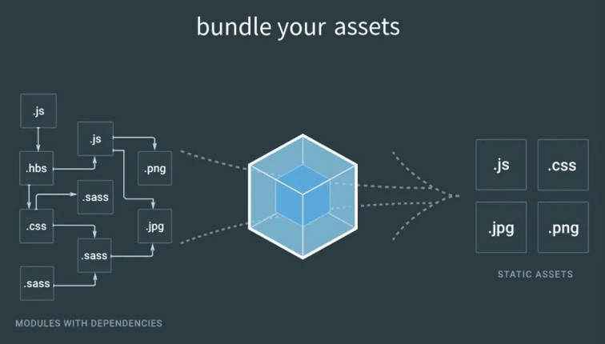

# 📌 **Criando um Projeto React do Zero**
## 🎯 **Objetivo**
Entender como o React funciona e criar um projeto do zero.

<br>

## 🌐 **Pré-requisitos**
Editor de código (Visual Studio Code)

<br>

## 🏁 **Percurso**
### **Etapa 1:** Babel
### **Etapa 2:** Webpack
### **Etapa 3:** Adicionar React em um projeto existente

<br>

## ✅ **Etapa 1: Babel**
É um Transpilador JavaScript de código aberto e gratuito, o Babel possui como uma das principais características converter código JavaScript atual em uma versão que o navegador possa executar.

É amplamente utilizado por desenvolvedores que necessitarem converter recursos da linguagem JavaScript para uma versão que o navegador compreenda.

<br>

### Configurando o Babel
Para este projeto foi criado a pasta "projeto-exemplo" e toda configuração deverá ser feita dentro da pasta, por tanto é necessário navegar pelo terminal até a pasta criada.

**Etapa 01:** Criando arquivo package.json
```
yarn init -y
```

**Etapa 02:** Instalando as dependecias do Babel
```
yarn add @babel/core @babel/preset-env @babel/preset-react babel-loader -D
```

**Etapa 03:** Criando arquivo .babelrc e configurando conforme doc
```
{
    "presets": [
        "@babel/preset-env",
        ["@babel/preset-react", {"runtime": "automatic"}]
    ]
}
```

<br>

## ✅ **Etapa 2: Webpack**
webpack é um module bundler (empacotador de módulos) para JavaScript, em outras palavras, ele junta os arquivos JS (e também outros formatos) da sua
aplicação (seja arquivos seus ou dependências externas) em um arquivo só (ou mais de um), de forma otimizada.

Os arquivos são unificados na ordem certa, sem duplicaç ão e podem ser minificados para reduzir o tamanho.



### Configurando o Webpack

**Etapa 01:** Instalando as dependecias
```
yarn add html-loader html-webpack-plugin webpack-cli webpack-dev-server style-loader css-loader file-loader -D
```

**Etapa 02:** Criando arquivo webpack.config.js e configurando o código abaixo nele.
```
const HtmlWebPackPlugin = require("html-webpack-plugin");

module.exports = {
    devtool: "source-map",
    entry: "./src/index.js",
    module: {
        rules: [
            {
                test: /\.js$/,
                exclude: /node_modules/,
                use: { loader: "babel-loader"}
            },
            {
                test: /\.html$/,
                use: [{ loader: "html-loader"}]
            },
            {
                test: /\.css$/,
                use: ["style-loader", "css-loader"]
            },
            {
                test: /\.(png|jpe?g|gif)$/i,
                use: ["style-loader"]
            },

        ],
    },
    resolve: {
        extensions: [".js", ".jsx"],
    },
    plugins: [
        new HtmlWebPackPlugin({
            template: "./public/index.html",
        }),
    ],
};
```

<br>

## ✅ **Etapa 3: Adicionar React em um projeto existente**

**Etapa 01:** Primeiro deve-se instalar o react via código abaixo no terminal
```
yarn add react react-dom -D
```

**Etapa 02:** Deve-se criar uma pasta public e dentro dela um arquivo index.html, com uma estrutura simples html5 e uma div com id root.

**Etapa 03:** Crie a pasta src e dentro dela o arquivo app.js com o código inicial abaixo:
```
const App = () => {
    return (
        <div className="App">
            <h1>Iniciando um Projeto</h1>
        </div>
    );
};

export default App;
```

**Etapa 04:** Crie o arquivo index.js dentro de src com o código inicial abaixo:
```
import React from "react";
import { createRoot } from 'react-dom/client';
import App from "./app";

const container = document.getElementById("root");
const root = createRoot(container);
root.render(<App />);
```

**Etapa 05:** No package.json crie um script customizado para inciar o servidor, sem a necessidade de ficar digitando o código toda hora:
```
"scripts": {
    "start": "webpack serve --open --hot --mode development",
    "build": "webpack --mode production"
  },
```

**Etapa 06:** Após todos os passos executados, inicie a aplicação com o comando ```yarn start``` ou ```npm start```

> para instalar o projeto utilize o comando no terminal ```npm start```

<br>

## 💻 **Links Úteis**
- https://pt-br.reactjs.org/docs/getting-started.html